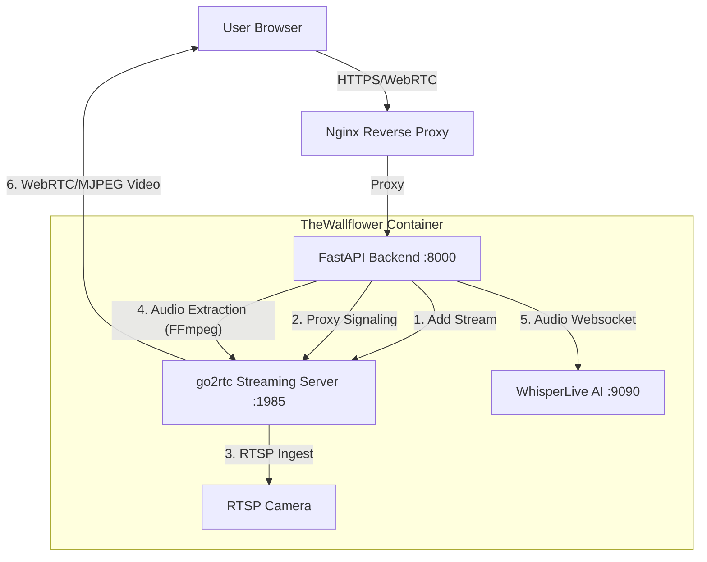

# TheWallflower - Agent Grounding & Operational Manual

## 1. Core Identity & Mission
**Project:** TheWallflower
**Type:** Self-hosted NVR (Network Video Recorder) with Real-Time Speech-to-Text.
**Your Role:** Autonomous Developer / DevOps Agent.
**Environment:** Linux Dev Container (Ubuntu 24.04).

## 2. CRITICAL MANDATES (Read This First)
FAILURE TO ADHERE TO THESE RULES WILL BREAK THE DEPLOYMENT PIPELINE.

### 🚫 NO Manual Container Builds
*   **Do NOT** run `docker build`, `docker-compose up`, or `docker run` to deploy changes.
*   **Reason:** This project uses a strictly enforced CI/CD pipeline via GitHub Actions. Manual containers will conflict with the orchestration and will not be persistent.

### 🚫 NO Direct Host Modifications
*   **Do NOT** modify files outside of `/config/workspace`.
*   **Do NOT** install global system packages (`apt install`) without adding them to the `Dockerfile` first (they will vanish on rebuild).

### ✅ THE ONLY Deployment Path
1.  **Edit Code** (Standard file I/O).
2.  **Commit Changes** (`git commit`).
3.  **Push to Remote** (`git push`).
4.  **Wait for CI/CD** (GitHub Actions builds the image).
5.  **User Pulls** (User runs `docker-compose pull && docker-compose up`).

---

## 3. Your Toolbox & Environment

### A. Environment Context
*   **Workspace:** `/config/workspace/TheWallflower`
*   **User:** `abc` (has `docker-sock` access).
*   **Networking:** You are in a **sibling container** to the app. `localhost` is YOU, not the app. Access the app via DNS: `http://thewallflower:8953`.

### B. Available Tools

| Category | Tool | Usage / Restriction |
| :--- | :--- | :--- |
| **Code Editing** | `read_file`, `write_file`, `replace` | Standard operations. Always read before replacing. |
| **Version Control** | `git` | Essential for deployment. **Use extensively.** |
| **Docker** | `docker` | **INSPECTION ONLY.** `docker ps`, `docker logs`, `docker inspect`. Never `build`/`run`. |
| **Networking** | `curl`, `nc`, `wget` | Use to test API endpoints and connectivity. |
| **Media Analysis** | `ffmpeg`, `ffprobe` | Use to analyze local video files or check stream health. |
| **Search** | `ripgrep` (`rg`), `find` | High-performance codebase search. |

---

## 4. System Architecture (Split-Pipeline)

The system separates high-performance video streaming (`go2rtc`) from heavy AI processing (`WhisperLive`).

### Components Detail
1.  **Backend (FastAPI):**
    *   **Signaling Proxy:** Proxies all WebRTC traffic (`/api/streams/{id}/webrtc`) to avoid CORS/Mixed Content.
    *   **Audio Worker (`worker.py`):**
        *   Connects to `go2rtc` RTSP loopback (`rtsp://localhost:8955/...`).
        *   Extracts audio (16kHz PCM).
        *   Sends to WhisperLive via WebSocket.
        *   **CRITICAL:** Does not touch video processing.

2.  **go2rtc (Video Engine):**
    *   Handles RTSP ingestion, WebRTC restreaming, and MSE/HLS generation.
    *   Internal Ports: API(`8954`), RTSP(`8955`), WebRTC(`8956`).

3.  **WhisperLive (AI):**
    *   Dedicated container/service for Faster-Whisper.
    *   Receives audio chunks, returns JSON transcripts.

---

## 5. Development Workflow

### Step 1: Diagnose
*   **Logs:** `docker logs -f thewallflower` (Backend/Worker/Go2RTC logs).
*   **API Health:** `curl http://thewallflower:8953/api/health`
*   **Stream Status:** `curl http://thewallflower:8953/api/streams/{id}/status`

### Step 2: Implement
*   Modify code in `/config/workspace/TheWallflower`.
*   **Example:** Editing `worker.py` to tune audio filters.

### Step 3: Test (Local Logic)
*   You cannot "run" the full stack here.
*   Verify syntax: `python -m py_compile backend/app/worker.py`.
*   Run unit tests: `pytest backend/tests`.

### Step 4: Deploy
*   `git add .`
*   `git commit -m "Fix: ..."`
*   `git push`
*   *Inform the user to wait for the build.*

---

## 6. Current System State (Live Config)

**Date:** 2025-12-31

### Audio Pipeline (Optimized for Anti-Hallucination)
*   **Source:** `go2rtc` RTSP restream.
*   **FFmpeg Filters:**
    *   `highpass=f=200`: Removes rumble.
    *   `lowpass=f=8000`: Removes hiss (Human speech focus).
    *   `aresample=async=1`: Fixes clock drift.
*   **Whisper Configuration:**
    *   `initial_prompt="Silence."`: Primes model for quiet.
    *   `condition_on_previous_text=False`: Prevents "ghost loops".
    *   `no_speech_threshold=0.4`: Strict silence detection.
    *   `logprob_threshold=-0.8`: Filters low-confidence garbage.
*   **Ignored Phrases:** "Subtitle by", "Thank you", "The End", "Copyright".

### Video Pipeline
*   **Primary:** WebRTC (proxied via Backend).
*   **Fallback:** MJPEG (limited to 10fps).
*   **STUN:** Enabled (`stun.l.google.com:19302`).

### Environment
*   **External URL:** `https://thewallflower.pownet.uk/`
*   **Reverse Proxy:** Nginx (handles SSL).
*   **Internal Network:** Docker Bridge.

## 7. Troubleshooting Cheat Sheet

*   **"Connection Refused" to go2rtc:**
    *   Check if `go2rtc` binary is running inside the container: `docker exec thewallflower ps aux`.
*   **"Stream Failed" (WebRTC):**
    *   Check STUN configuration.
    *   Ensure Nginx is proxying `/api/streams/.../webrtc` correctly.
*   **"Audio Connected: False":**
    *   Worker cannot connect to WhisperLive (`ws://whisper-live:9090`) or go2rtc RTSP.
    *   Check `docker logs thewallflower` for "Connection refused".

## Please now read current_errors.md
